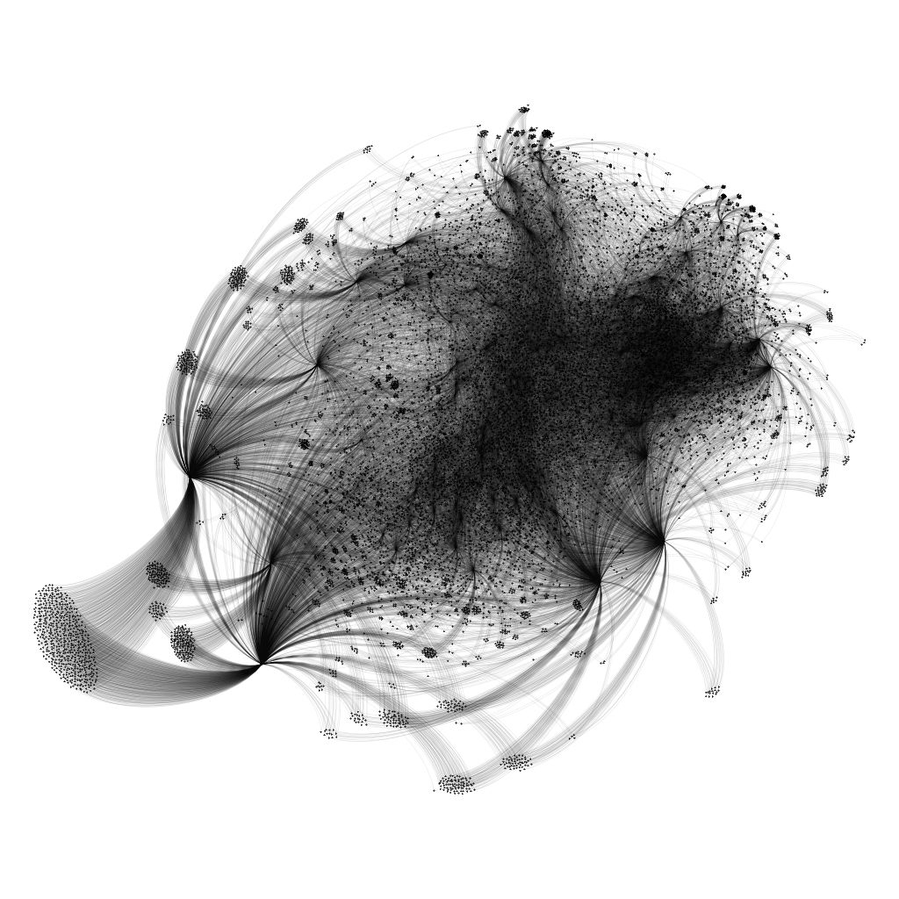

Twitter Friend Connections
======
# 

# Update 2021
I realized `networkx` is not a goot tool for Visualizing, I found `Gephi` a handy and powerful tool for visualizing, so now I can draw 300k nodes (from 1.3m dataset)
# 

### To-Do List
- [x] Collect users followers data using twitter api
- [x] Visualize connection graph using graph-tools
- [ ] Analyze connections
- [x] Collect profiles data
- [ ] Plot convolution hitmap of users
- [ ] Classification users base on followers and followings
